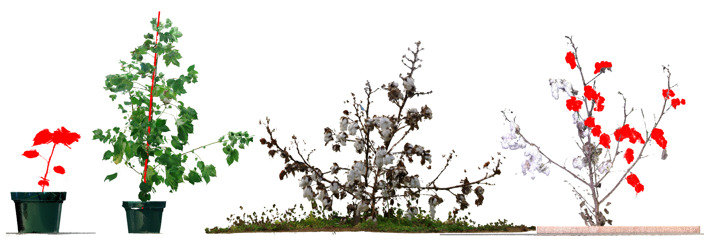
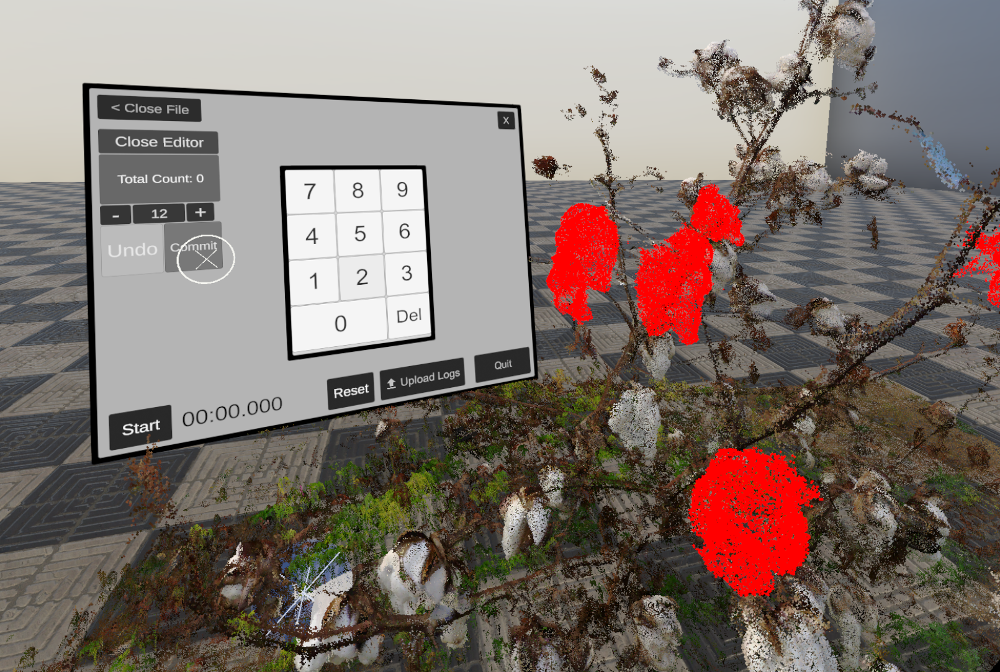

# DataFoldvr


Point cloud annotation tool for both virtual reality and a 2D desktop interface. Import and export point clouds in .pcd format.

This work presents a hybrid immersive headset- and desktop-based virtual reality (VR) visualization and annotation system for point clouds, oriented towards application on laser scans of plants.  The system can be used to paint regions or individual points with fine detail, while using compute shaders to address performance limitations when working with large, dense point clouds. The system can either be used with an immersive VR headset and tracked controllers, or with mouse and keyboard on a 2D monitor using the same underlying rendering systems. A within-subjects user study (N=16) was conducted to compare these interfaces for annotation and counting tasks. Results showed a strong user preference for the immersive virtual reality interface, likely as a result of perceived and actual significant differences in task performance. This was especially true for annotation tasks, where users could rapidly identify, reach and paint over target regions, reaching high levels of accuracy with minimal time, but we found nuances in the ways users approached the tasks in the two systems.



Cite:

```bibtex
@inproceedings{franzluebbers2022virtual,
  title={Virtual reality point cloud annotation},
  author={Franzluebbers, Anton and Li, Changying and Paterson, Andrew and Johnsen, Kyle},
  booktitle={Proceedings of the 2022 ACM Symposium on Spatial User Interaction},
  pages={1--11},
  year={2022}
}
```
